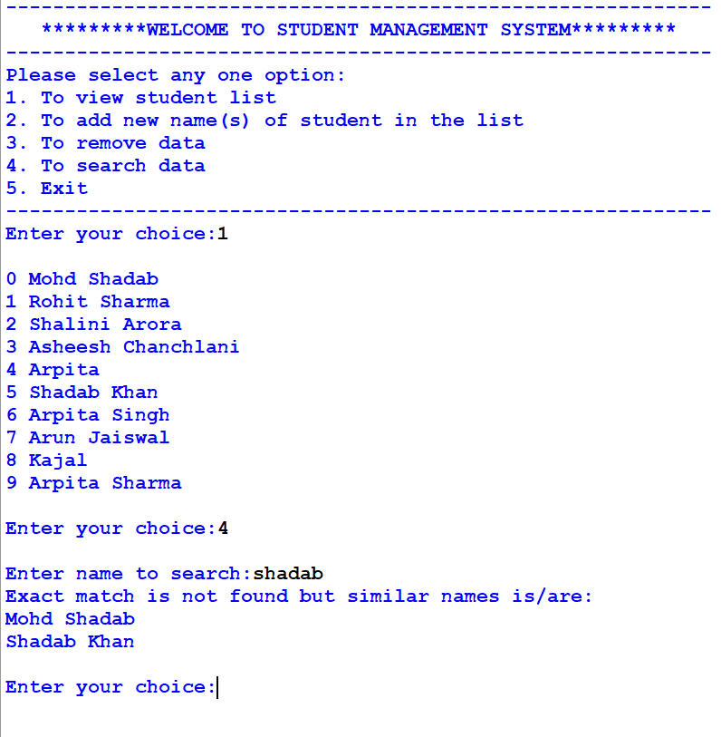

# Student_Management_System

# Use Cases
The code is written in python to manage student data like recording, deleting and searching student names.

# Advantage
Here, I used a 'Soft Search' option, means you can search name either using the first name or last name or both, the system will give you all possible names that best matches to your search.
